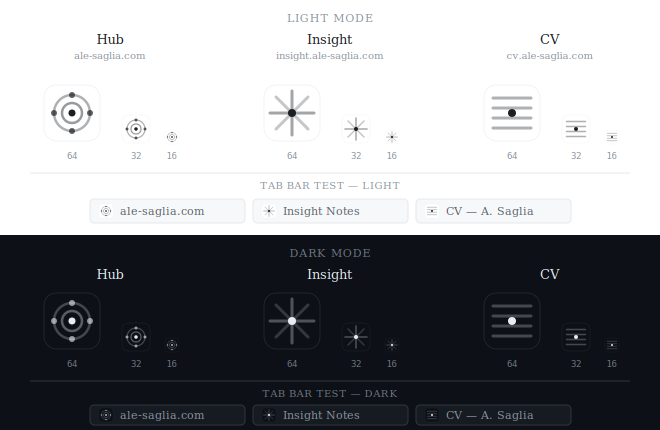

# Design system — ale-saglia.com triptych

Visual reference shared across three sites:

| Site | URL | CSS delivery |
| --- | --- | --- |
| **Hub** | ale-saglia.com | inline `<style>` in `index.html` |
| **Insight** | insight.ale-saglia.com | external `/assets/styles.css` |
| **CV** | cv.ale-saglia.com | inline `<style>` in `index.html` |

Canonical values are in [`tokens.css`](tokens.css). The favicon system is in [`favicon_system.html`](favicon_system.html).

---

## Color palette

### Light mode — identical across all three sites

| Token | Value | Usage |
| --- | --- | --- |
| `--bg` | `#ffffff` | page background |
| `--text` | `#1b1f23` | primary text |
| `--muted` | `#5b636a` | secondary text — labels, descriptions, footer |
| `--line` | `#e6e8eb` | borders, dividers, separators |
| `--link` | `#0b57d0` | links, interactive elements, focus outlines |

### Dark mode — identical across all three sites

| Token | Canonical | Hub | Insight | CV |
| --- | --- | --- | --- | --- |
| `--bg` | `#0d1117` | ✓ | ✓ | ✓ |
| `--text` | `#e6edf3` | ✓ | ✓ | ✓ |
| `--line` | `#30363d` | ✓ | ✓ | ✓ |
| `--link` | `#58a6ff` | ✓ | ✓ | ✓ |
| `--muted` | **`#8b949e`** | ✓ | ✓ | ✓ |

---

## Typography

| Property | Value | Notes |
| --- | --- | --- |
| `font-family` | `Georgia, "Times New Roman", serif` | identical across all three |
| `line-height` | `1.7` | Hub and Insight; CV uses `1.6` (denser content) |
| `box-sizing` | `border-box` | universal |

No custom fonts — system fonts for performance and privacy.

---

## Layout

| Property | Value | Notes |
| --- | --- | --- |
| Container | `min(760px, 92vw)` | identical across all three |
| Mobile breakpoint | `700px` | identical across all three |
| Grid (Hub) | `1fr 1fr` → `1fr` on mobile | only Hub has the two-column grid |

---

## Site structure

### Hub — ale-saglia.com

- Centred header, no bottom border
- About section with circular avatar 120×120px (float left on desktop, block on mobile)
- 2-column grid: "Discover more" + "Profiles"
- No navigation — single-page structure

### Insight — insight.ale-saglia.com

- Header with bottom border (`var(--line)`)
- Horizontal nav with domain dropdown (all three sites)
- Article archive with tag/domain filters
- External CSS (`/assets/styles.css`, ~735 lines)

### CV — cv.ale-saglia.com

- Nav with bottom border and language switcher (IT/EN)
- Domain dropdown (all three sites)
- CV structure: h2 sections with bottom borders, entries with `cv-meta` (flex, dates right-aligned)
- Inline CSS (~730 lines)

---

---

## Favicon system

Three distinct icons, one visual language.



### Construction principles

All three share the same visual grammar:

- **Background**: rounded rectangle `rx="12"`, adaptive fill and border (`#ffffff`/`#e6e8eb` light, `#0d1117`/`#30363d` dark)
- **Primary stroke**: opacity `0.35–0.45` — Hub's concentric rings, gives depth without visual weight
- **Secondary stroke**: opacity `0.18–0.25` — Insight's diagonal lines
- **Central dot**: solid filled circle, the visual anchor of each icon (`r="3.5"` Hub, `r="4"` Insight and CV)
- **Satellite nodes**: Hub only (`r="3"`, opacity `0.7`) — the four cardinal points of the network
- **Designed at 16px**: all detail calibrated to remain legible at minimum browser tab size

| | Hub | Insight | CV |
| --- | --- | --- | --- |
| **Pattern** | concentric rings + 4 cardinal nodes | cross + diagonals + dot | 4 horizontal rules + dot |
| **Concept** | network, hub, connection | orientation, analysis, compass | document, structure, timeline |

### SVG source — light mode

#### Hub

```svg
<svg viewBox="0 0 64 64" xmlns="http://www.w3.org/2000/svg">
  <rect x="4" y="4" width="56" height="56" rx="12" fill="#ffffff" stroke="#e6e8eb" stroke-width="0.5"/>
  <circle cx="32" cy="32" r="18" fill="none" stroke="#1b1f23" stroke-width="2.5" opacity="0.35"/>
  <circle cx="32" cy="32" r="10" fill="none" stroke="#1b1f23" stroke-width="2.5" opacity="0.45"/>
  <circle cx="32" cy="32" r="3.5" fill="#1b1f23"/>
  <circle cx="32" cy="14" r="3" fill="#1b1f23" opacity="0.7"/>
  <circle cx="50" cy="32" r="3" fill="#1b1f23" opacity="0.7"/>
  <circle cx="32" cy="50" r="3" fill="#1b1f23" opacity="0.7"/>
  <circle cx="14" cy="32" r="3" fill="#1b1f23" opacity="0.7"/>
</svg>
```

#### Insight

```svg
<svg viewBox="0 0 64 64" xmlns="http://www.w3.org/2000/svg">
  <rect x="4" y="4" width="56" height="56" rx="12" fill="#ffffff" stroke="#e6e8eb" stroke-width="0.5"/>
  <line x1="32" y1="10" x2="32" y2="54" stroke="#1b1f23" stroke-width="3" opacity="0.4" stroke-linecap="round"/>
  <line x1="10" y1="32" x2="54" y2="32" stroke="#1b1f23" stroke-width="3" opacity="0.4" stroke-linecap="round"/>
  <line x1="16" y1="16" x2="48" y2="48" stroke="#1b1f23" stroke-width="3" opacity="0.25" stroke-linecap="round"/>
  <line x1="48" y1="16" x2="16" y2="48" stroke="#1b1f23" stroke-width="3" opacity="0.25" stroke-linecap="round"/>
  <circle cx="32" cy="32" r="4" fill="#1b1f23"/>
</svg>
```

#### CV

```svg
<svg viewBox="0 0 64 64" xmlns="http://www.w3.org/2000/svg">
  <rect x="4" y="4" width="56" height="56" rx="12" fill="#ffffff" stroke="#e6e8eb" stroke-width="0.5"/>
  <line x1="13" y1="17" x2="51" y2="17" stroke="#1b1f23" stroke-width="3" opacity="0.35" stroke-linecap="round"/>
  <line x1="13" y1="27" x2="51" y2="27" stroke="#1b1f23" stroke-width="3" opacity="0.35" stroke-linecap="round"/>
  <line x1="13" y1="37" x2="51" y2="37" stroke="#1b1f23" stroke-width="3" opacity="0.35" stroke-linecap="round"/>
  <line x1="13" y1="47" x2="51" y2="47" stroke="#1b1f23" stroke-width="3" opacity="0.35" stroke-linecap="round"/>
  <circle cx="32" cy="32" r="4" fill="#1b1f23"/>
</svg>
```

Dark mode swap: `fill="#ffffff"` → `fill="#0d1117"`, `stroke="#e6e8eb"` → `stroke="#30363d"`, all `#1b1f23` → `#e6edf3`.
